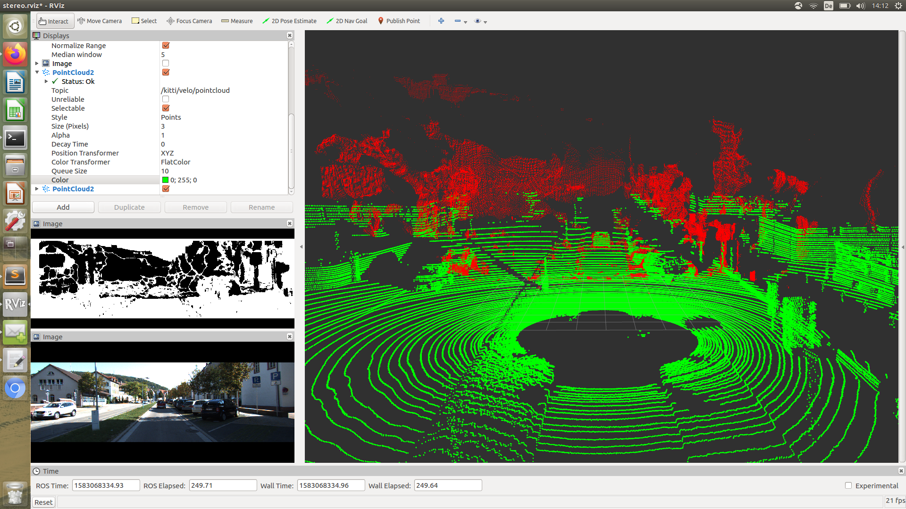

# SAStereoImage

ROS node to create pointcloud out of stereo images from the KITTI Vision Benchmark Suite  

## Demo




## Usage

This is a side project of my main project: https://github.com/appinho/SARosPerceptionKitti  
Orientate yourself there to set up the project and acquire the data.  

To run it use the following commands:  

```
cd ~/catkin_ws/src
git clone https://github.com/appinho/SARosPerceptionKitti.git
cd ~/catkin_ws
catkin_make
source devel/setup.bash
roslaunch stereo_image demo.launch home_dir:=YOUR_HOME_DIRECTORY scenario:=0060
```
