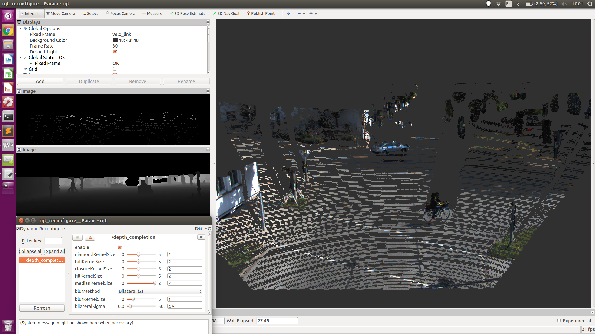

# SASensorProcessing

ROS node to create pointcloud out of stereo images and complete sparse pointclouds from the KITTI Vision Benchmark Suite  

## Demos
### Stereo Vision

<p align="center">
  
</p>

### Depth Completion

<p align="center">
  
</p>


## Run

```
roslaunch sensor_processing stereo_vision.launch home_dir:=YOUR_HOME_DIRECTORY scenario:=0060
roslaunch sensor_processing depth_completion.launch home_dir:=YOUR_HOME_DIRECTORY scenario:=0060
```

## Background & Set up

This is a side project of my main project: https://github.com/appinho/SARosPerceptionKitti  
Orientate yourself there to set up the project and acquire the data.  

To run it use the following commands:  

```
cd ~/catkin_ws/src
git clone https://github.com/appinho/SASensorProcessing.git
cd ~/catkin_ws
catkin_make
source devel/setup.bash
```

## Sources

* [ROS Image processing wiki](http://wiki.ros.org/stereo_image_proc)
* [Depth completion paper](https://arxiv.org/pdf/1802.00036v1.pdf)
